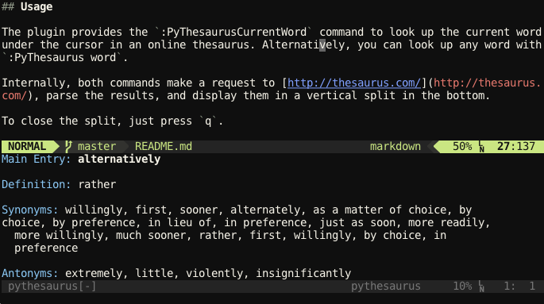

# Vim PyThesaurus

This is a plugin for Vim allowing you to look up words on [http://thesaurus.com/](http://thesaurus.com/)

This is a rewrite of [Anton Beloglazov's Online Thesaurus](https://github.com/beloglazov/vim-online-thesaurus) using Vim's Python interface. Anton's plugin uses bash shell scripting, which might be a problem in some environments (ie., Windows).

The plugin displays the definition of the word under the cursor and a list of synonyms and antonyms.



The credit for the original idea and (part of) code goes to [Nick Coleman](http://www.nickcoleman.org/) and [Anton Beloglazov](http://beloglazov.info/).


## Installation

If you are using Vundle, just add the following line to your .vimrc:

```
Bundle 'drougas/vim-pythesaurus'
```

Then run `:BundleInstall` to install the plugin.


## Usage

The plugin provides the `:PyThesaurusCurrentWord` command to look up the current word under the cursor in an online thesaurus. Alternatively, you can look up any word with `:PyThesaurus word`.

Internally, both commands make a request to [http://thesaurus.com/](http://thesaurus.com/), parse the results, and display them in a vertical split in the bottom.

To close the split, just press `q`.


## Configuration

You can map the `:PyThesaurusCurrentWord` command to anything you want as follows:

```
nnoremap <your key binding> :PyThesaurusCurrentWord<CR>
```

For example, to bind `\K`:
```
nnoremap <unique> <LocalLeader>K :PyThesaurusCurrentWord<CR>
```

Enjoy!


## License

Distributed under the same terms as Vim itself.
See `:help license.`
